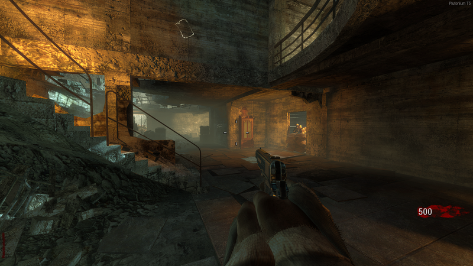
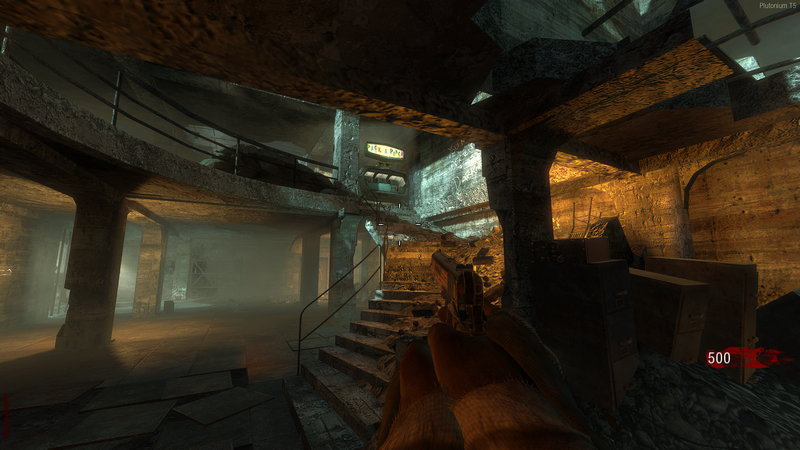
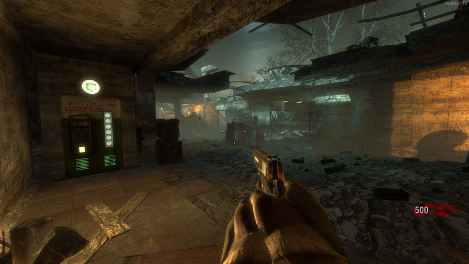

# Nacht Der Untoten spawn room challenge mod (T5SP)

This is a mod for Nacht Der Untoten on T5SP I made during the period I was trying to fix voicelines/session errors.

I hosted it a few weeks on some servers named `Nacht Der Untoten | Spawn Room ONLY (mod)`.

Today I decided to clean up the code and make a proper release of it. I don't feel like touching it again for the moment.

## Mod description

You are stuck in the spawn room of Nacht Der Untoten, you won't be able to go upstairs or open the door, don't cry and just survive.
- No barriers
- No carpenter
- Instant fast zombies
- Box moved to spawn room, unlocks at round 5
- Weapon cabinet moved to spawn room, the sniper inside it will always one hit kill if headshot
- Radio moved to spawn room
- Mule kick has been replaced with speed cola, unlocks round 10
- Added Pack-A-Punch (with custom fx to make upgrading looks more real), unlocks round 15
- Can buy grenades on the wall (must jump)
- The two wall weapons are randomized every game (except sawed-off)
- Other wall weapons are available in the box
- Included mp40
- Upgrading ballistic knife will give you its bowie variant
- Cool vision
- Alcohol

NOTE: WaW weapons cannot be upgraded because the map doesn't have their upgraded variant.

## Installation

Download the [latest release](https://github.com/Nahelam/t5sp-nacht-srcm/releases/latest/), extract the ZIP archive content to your T5 storage folder and you're good to go.

Default T5 storage folder on Windows: `%LOCALAPPDATA%\Plutonium\storage\t5`

## Screenshots

